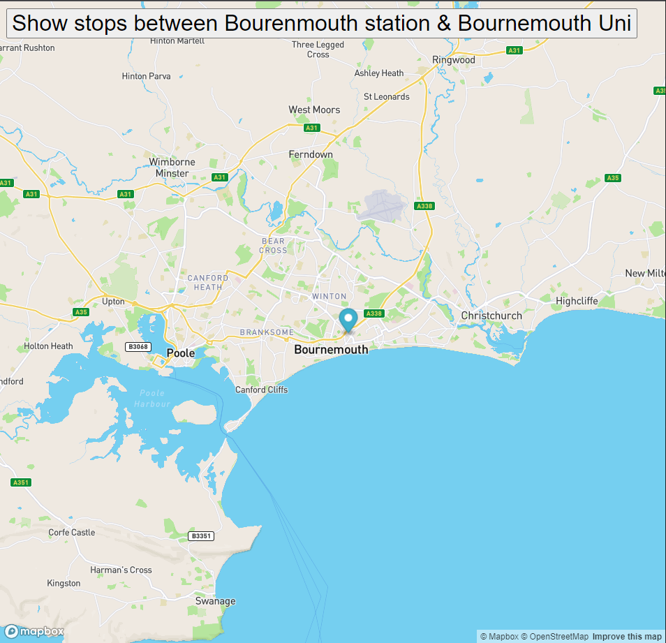

# <a href="https://github.com/23h1/busroute"> Bus route </a>

A simple utility to animate a bus route using a marker (over bus stops)

When time permits, I might build on this to explore Mapbox APIs further.

The route here is from Bournemouth railway station to Bourneouth Uni.

